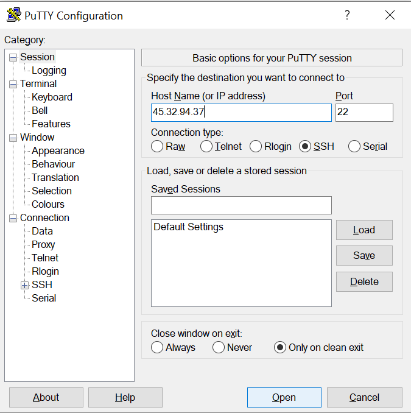
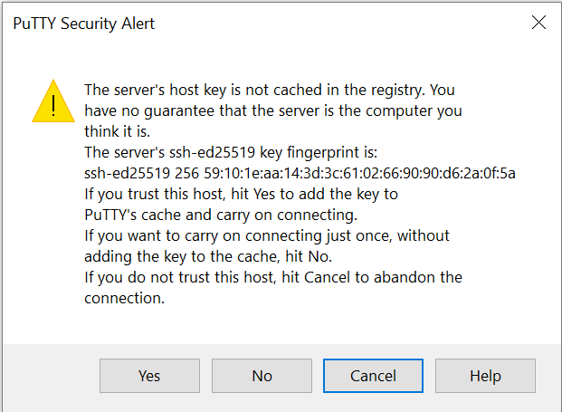
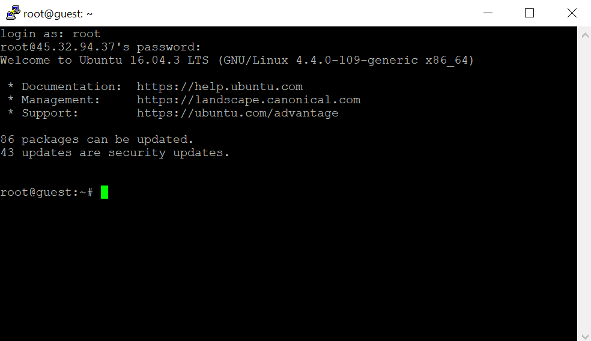

---
# You don't need to edit this file, it's empty on purpose.
# Edit theme's home layout instead if you wanna make some changes
# See: https://jekyllrb.com/docs/themes/#overriding-theme-defaults
layout: default
---

## Masternode Wallet Setup

### Step 1

We need to add the “Masternode Tab” in the $Pac wallet.
Click on setting > options           


Click on Wallet Tab


Select “show Masternode tab”

Click OK

Exit the wallet and restart

### Step 2

Open a text editor such as notepad or sublime, leave blank to store information.

In your $Pac wallet select > Tools > Debug Console 


Then select the console tab.


Create a masternode genkey by typing:
```
masternode genkey
```


The Masternode genkey will appear in the console. Copy and paste it to your notepad. Make sure to label it MN1. 

Keep all of your information together we will use it later on.

### Step 3

Next you will need to send 500,000 $PAC coins to yourself.
Click Receive on left menu on under $Pac Logo.

Type MN1 in label box.
Type 500000 in the amount box
Click request payment. Copy address.

Click Send on left menu on under $Pac Logo.

Paste the request address you just created. Once pasted the Label should automatically say MN1 so you know the coins are going back to your wallet and not to someone else. For a precaution you can double check the first and last few characters on the send address and receive address.

### Step 4
Once you have 15 conformations (check by mousing over payment in transaction window)  go back to the debug/console window and type:  
```
masternode outputs
```
and press enter.

Copy the Masternode outputs to your notepad so we can correctly format it for later use.

The code you paste will look like
```
{

e4chhijdjjinshhjj65jdkkrjjrjjf7jjs8ejdjjkkdk :1

}
```
Now
To format the Masternode outputs code remove non-alphanumeric characters (brackets and colon) so it looks like this: 
```
e4chhijdjjinshhjj65jdkkrjjrjjf7jjs8ejdjjkkdk 1
```
Make sure to keep the “space” at the end between long address and last number.

* * *

# VPS SETUP

## Get a VPS system for your masternode(s)

I will use vultr for my instructions.<a href="https://www.vultr.com/?ref=6903109"> Register / login with vultr.</a>

Feel free to use my reflink to signup and receive a bonus w/ vultr:
<a href="https://www.vultr.com/?ref=6903109"></a>

## Deploy a new system

First, create a new VPS by clicking that small "+" button.


## Location choice

The location doesn't matter too much. If in doubt, choose a location near you.


## Linux distribution (Ubuntu 16.04 LTS)

Select Ubuntu 16.04 x64.


## VPS size

A decent masternode needs a bit of RAM and some storage space. The $5 instance is good enough.


## Hostnames

Choose a hostname you want and click "Deploy Now". I called mine :
```
PAC_Masternode1
```


## Accessing your VPS via SSH

Copy access credentials for SSH access by opening the server details.


## First SSH session

(Windows 7, 8, 9 & 10) Download Putty <a href="http://www.putty.org/">http://www.putty.org/</a>

Type ypur IP address from vultr into the Hostname and press Open.


An authentication screen may popup something like this (below) press Yes to continue


It will access for your username enter
```
root
```
It will then ask for the password. Copy it across from you Vultr dashboard and press enter. You should end up with a screen like below:


## Masternode script installation

Copy the following and press enter.
```
wget https://raw.githubusercontent.com/PACCommunity/PAC/master/pacmn.sh
```
Once the script has downloaded type:
```
chmod +x pacmn.sh
```
Wait for the command to finish then type:
```
./pacmn.sh
```
The script will prompt for your external IP address from Vultr. Copy or type it, then press enter.

Then it will ask for the masterenode genkey that you generated earlier. Copy it across and and press enter.

The script downloads, compiles and configures the system now. This will usually take between 5-15 minutes.

### Step 5

Now go back to your wallet click Tools > open masternode configuration file. 

We want to add in a line with the following details. Pay attention to the spacing:
```
<Name of Masternode(Use the name you entered earlier for simplicity)> <Vultr IP address>:7112 <The result of Step 2> <Result of Step 4> <The number after the long line in Step 4>
```
Substitute it with your own values and without the “<>”s So it should look like something below:
```
MN1 192.168.0.1:7112 PEzekAsRvh9Ej9s6RZLoAi8f265xAYb6kX e4chhijdjjinshhjj65jdkkrjjrjjf7jjs8ejdjjkkdk 1 
```


Exit then restart the wallet

Go to masterernode tab

click the “start alias” button
click okay to start MN1.

Now to test that everything is up and running.
From putty type the following:
```
./paccoin-cli masternode status
```
It should output something similar to
```

{
  "outpoint": "f5abcdabcdabcdabce4d1ab87a32a8c848d554c935a89b46c3f7cd1fc8b4c-                                                                                                                 1",
  "service": "192.168.1.1:7112",
  "payee": "P56742312345678945612345679wXgzXDa6FFydG",
  "status": "Masternode successfully started"
}
```


* * *
## Troubleshooting the masternode on the VPS

If you want to check the status of your masternode, the best way is currently running the paccoin-cli

start daemon
```
./paccoind
```
Stop daemon
```
./paccoin-cli stop 
```
Masternode status
```
./paccoin-cli masternode status
```
```
./paccoin-cli getinfo
```

## Useful Websites
http://monitor.masternodes.work/monitor
http://pacmaster.nomukaiki.com/#!masternodes

## Credits
http://altcoin-guide.com/paccoin-vps-masternode-guide/
http://monitor.masternodes.work/monitor
http://pacmaster.nomukaiki.com/#!masternodes
https://discord.gg/SdYuCm
***
## Donations
$PAC - PAgYbqC18zjJA3vbuuXYKMbhdyxovCJDhZ
BTC - 33nXMpUbCEEK68Xb711Eda5Fn9vsyQWvMe


